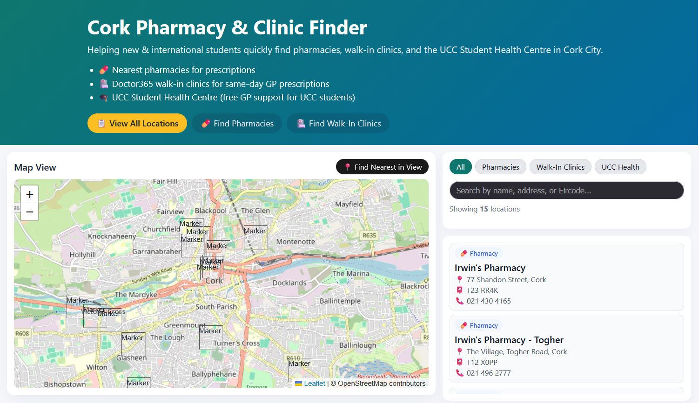
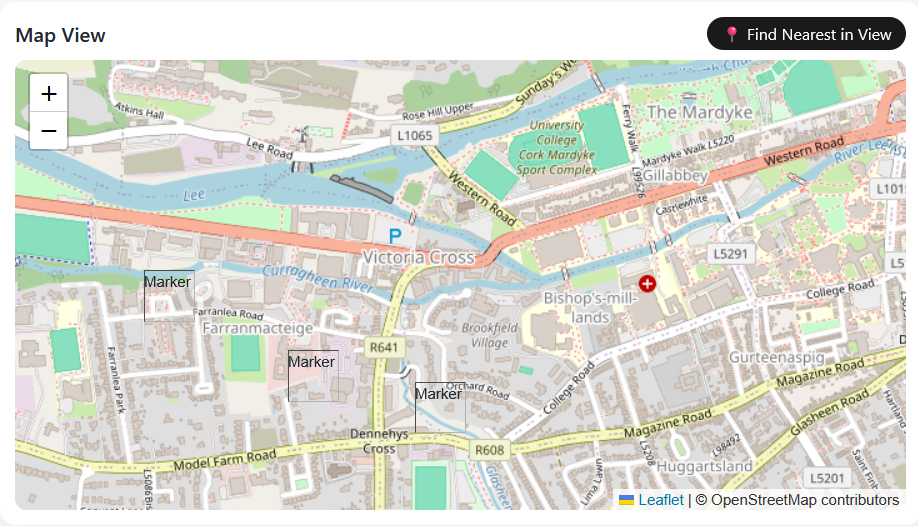
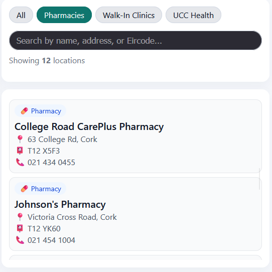
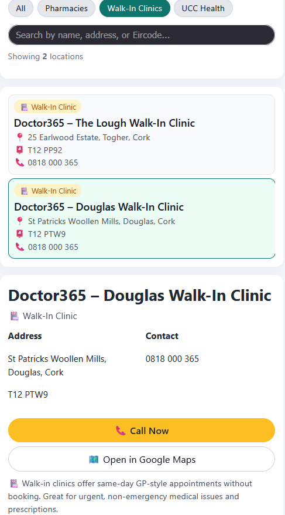

# Cork City Pharmacy & Walk-In Clinic Locator App

Helping new & international students quickly access healthcare services in Cork City.

---

## 📍 Overview

This is a modern, responsive **React web application** that helps users quickly locate:

- 💊 Pharmacies in Cork City  
- 🏥 Doctor365 Walk-In Clinics for same-day GP prescriptions  
- 🎓 UCC Student Health Centre (free GP consultations for UCC students)

The app is designed especially for **new and international students** who may be unfamiliar with how healthcare works in Ireland.

This project was **originally prototyped as a Python Kivy/BeeWare mobile app**, and later redesigned as a full-featured **React + Leaflet web application** to improve accessibility and usability across devices.

---

## 🎯 Target Audience

- New students living in Cork  
- International students unfamiliar with Irish healthcare services  
- Residents needing quick access to pharmacies or walk-in clinics  

---

## 🚀 Key Features

### 🗺 Interactive Map
- Displays **12 pharmacies** and **3 clinics** across Cork City
- Built with **Leaflet**
- Clickable markers showing name, address, and service type

### 🔍 Location Filters
Filter locations by:
- All  
- Pharmacies  
- Walk-In Clinics  
- UCC Student Health Centre  

### 📍 Nearest Location Detection
- Uses the **Haversine distance formula**
- Identifies the closest pharmacy or clinic based on user location

### 📞 Quick Actions
Each location card includes:
- Full address & Eircode
- Phone number
- One-tap **Call Now**
- **Open in Google Maps** navigation

### 🎓 Educational Section
- Explains the difference between pharmacies, walk-in clinics, and GPs
- Highlights **free GP services available to UCC students**

---

## 🛠 Tech Stack

| Area | Tools |
|-----|------|
| Frontend | React, Vite, JavaScript |
| Mapping | Leaflet.js |
| Styling | CSS3 |
| Data | Static dataset (pre-validated coordinates) |
| Original Prototype | Python, Kivy, BeeWare |

---

## ⚠️ Challenges & Lessons Learned

### Leaflet Marker Issues
- Markers initially failed to render due to missing Leaflet CSS in a Vite environment
- Fixed by globally importing Leaflet styles and marker assets in `main.jsx`

### Geocoding Limitations
- Runtime geocoding APIs caused reliability and rate-limit issues
- Resolved by using **pre-validated latitude/longitude derived from Eircodes**

### UI & Accessibility
- Improved color contrast and layout for better readability
- Focused on mobile-first design for new users navigating Cork

These challenges strengthened my skills in:
- Debugging frontend libraries
- Map-based UI development
- Building user-focused healthcare tools

---

## 🌱 Future Improvements

- Custom map icons for pharmacies, clinics, and UCC health
- Auto-zoom map to filtered results
- Real-time opening hours
- Backend API (FastAPI / Supabase)
- React Native mobile version

---

## 📸 Screenshots

### Home Page

### Interactive Map

### Filters in Action

### Location Details

---

## ⚠️ Disclaimer

This app is for **informational purposes only** and does not replace professional medical advice.  
For emergencies, always contact **112 or 999**.
